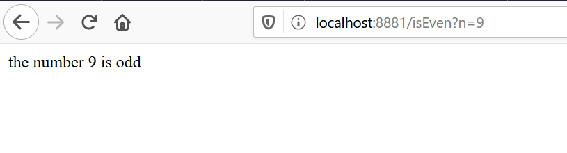
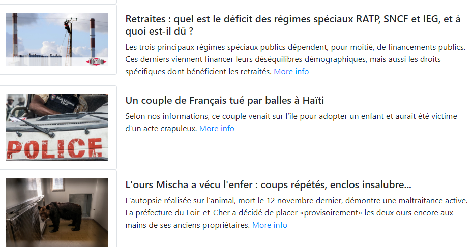

# TP TORNADO

Ce TP a pour but de vous introduire Tornado web Framework dans le cadre du cours IFI. Le Tp sera subdivisé en trois exercices indépendants à compléxité croissante.

## Initialisation de l'environnement

Création de votre environnement virtuel : `virtualenv env_name -p python3`

Activation de votre environnement virtuel : `source env_name/bin/activate`

Toutes les commandes utiles devront maintenant être exécutées avec l'environment virtuel actif.

Pour sortir de l'environnement virtuel `deactivate`

Installation de Tornado dans l'environnement virtuel : `pip3 install tornado`


## Exercice 1: Première application

Nous avons vu la structure typique d'une application web avec Tornado. (cf Diapo page 14) 

Maintenant, Nous allons essayer de mettre en pratique tout cela ;)!!

  On va vous demander de réaliser votre première application, c'est tout simple:
  
  * Créez une application qui prends en entrée un nombre (le nombre sera récupéré depuis la requête HTTP) et qui affiche un simple message nous disant si le nombre est pair ou impair.


  * Ensuite faites le même exercice mais en utilisant un template html.
  
***`Note: tornado.web.RequestHandler.get_argument()  pourrait vous être utile`***

Si tout se passe bien, vous aurez cela comme résultat:



## Exercice 2: REST API

Tornado peut être aussi utilisé pour développer des applications REST. Nous allons donc apprendre  
à travers cet exercice comment developper une API REST.
 

***`Note: Afin de tester notre API nous allons utiliser un client REST: Advanced REST Client ou Postman ou curl`***   
[Advanced REST Client](https://chrome.google.com/webstore/detail/advanced-rest-client/hgmloofddffdnphfgcellkdfbfbjeloo?hl=fr) 

Description:

Nous allons utliser Tornado pour gérer l'ajout et la suppression d'item dans une liste d'items.

Pour ce faire vous avez à votre disposition un fichier items.py que vous allez devoir compléter pour faire fonctionner l'API.

Les items seront sous format JSON:
```
{
  "id":1,
  "name": "blabla"
}
```

Il va falloir récupérer le Json dans la request.body et l'ajouter à la liste des items.


Il vous est aussi demandé  de rajouter un Requesthandler `printItems`pour afficher sur une page les items dans la liste.


## Exercice 3: Articles

L'objectif de cet exercice est d'afficher une liste d'articles récupérés depuis une api : "https://newsapi.org/v2/top-headlines?sources=google-news-fr&apiKey=9e1d0b0198fa42f8b8966332df05b8ed"    

L'arborescence de l'exercice : 
    - un fichier python "article.py"
    - un dossier templates comprenant : "index.html", "article.html"

### Récupération des articles 
Dans un premier temps, on cherche à récuperer la liste d'articles depuis l'api, pour ce faire il sera donc nécessaire d'implementer un RequesHandler : `MainHandler`

L'api vous retournera un json. Vous trouverez dans le lien suivant les détails de sa structure : https://newsapi.org/ 

**PS : Vous aurez peut être besoin d'utiliser une/des méthodes asynchrones**

### Affichage des articles
Dans un second temps, on cherche à afficher les articles récupérés précédemment, vous aurez donc besoin d'utilisez un template ('index.html'). 
Vous aurez pour mission, si toutefois vous l'acceptez,  d'afficher une liste d'articles. Voici, un aperçu final :     



**PS : vous pouvez étendre le template "base.html" pour l'utilisation de bootstrap. Pour avoir le même affichage que ci-haut vous pouvez visiter les liens suivants**   
   
    https://getbootstrap.com/docs/4.0/layout/media-object/      
    https://getbootstrap.com/docs/4.0/content/images/   
    https://getbootstrap.com/docs/4.0/utilities/sizing/   
    
### More Info 

Maintenant que la liste d'articles s'affiche correctement, on souhaite pouvoir accéder à d'avantages d'informations sur un article précis comme on peut le constater sur la dernière image : `More Info`. Pour cela, il va falloir implémenter un nouvel RequestHandler, appeler le `ArticleDetailHandler`. 
Vous aurez donc besoin de stocker la liste d'articles que vous aviez récupérée dans le `MainHandler`, même si il existe sûrement d'autres moyens de stocker cette liste, dans le notre on se contentera d'une variable globale.

Afin de récupérer un article précis, vous pouvez utiliser dans le template la fonction [enumerate](http://book.pythontips.com/en/latest/enumerate.html) de Python.

Une fois toutes ces étapes faites, il ne vous reste plus qu'à implémenter votre classe `ArticleDetailHandler`.

Petit aperçu de ce qui est souhaité :   


### Affichage des articles de plusieurs API
Nous avons maintenant envie de récupérer des informations provenant de différentes api. 

API :  "https://newsapi.org/v2/top-headlines?sources=google-news-in&apiKey=9e1d0b0198fa42f8b8966332df05b8ed", "https://newsapi.org/v2/top-headlines?sources=google-news-fr&apiKey=9e1d0b0198fa42f8b8966332df05b8ed"

Modifier le fichiers article.py, pour qu'il puisse récupérer et afficher ces informations

### Pour aller plus loin

Mettez la récupération des articles dans une méthode, ensuite faites en sorte que cette méthode soit appélée à intervalle de 2 min et mette à jour la liste des articles.   
`PS: Google est votre ami ;)`

